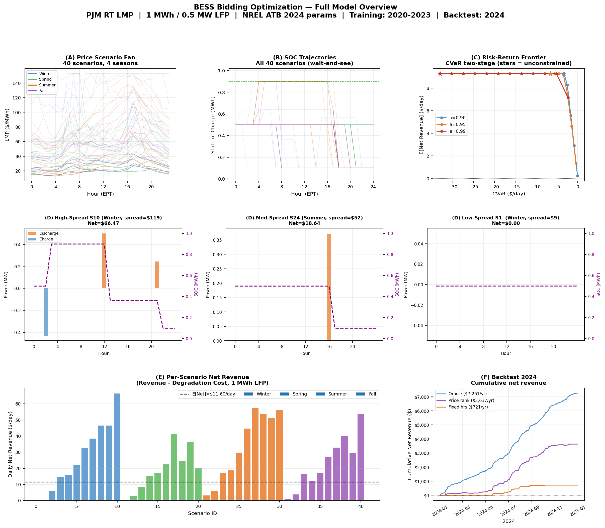
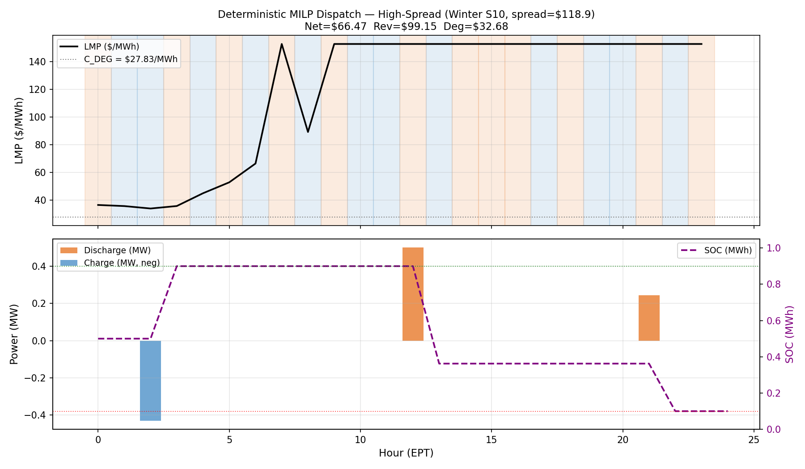
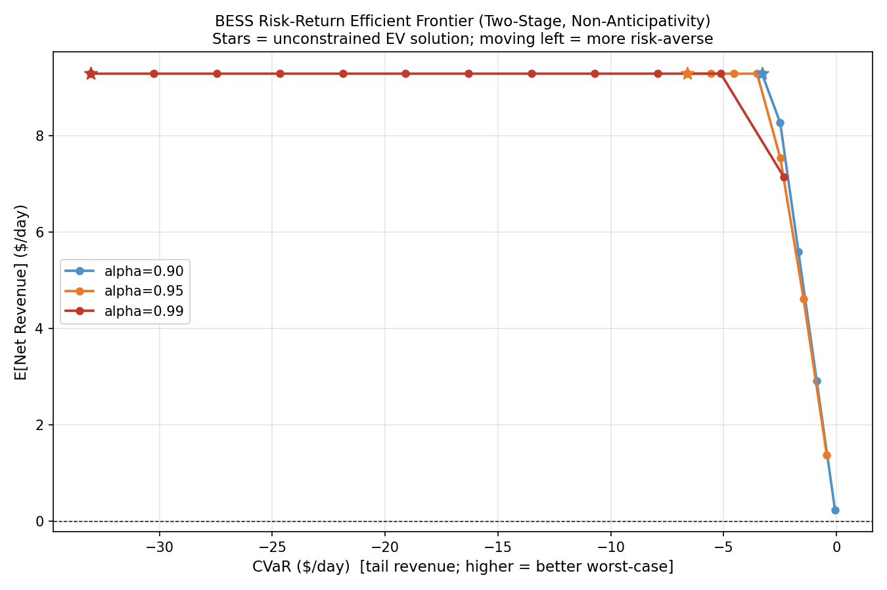
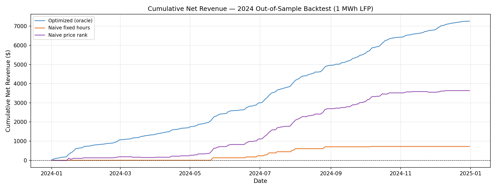
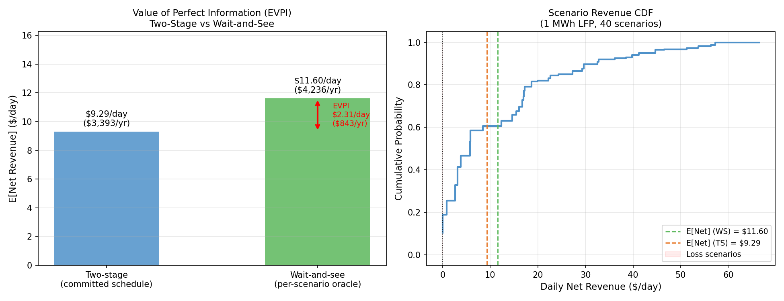
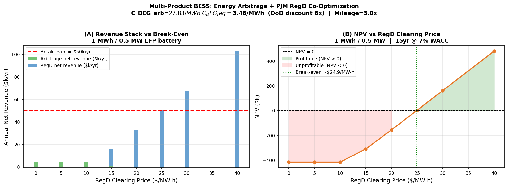

# ELEN 4510 — BESS Bidding Optimization
## Presentation Script & Slide Notes
**Target length:** 12 minutes | **~10 slides across 6 sections**

Design principle: slides are visual anchors only. One idea per slide. Script carries the content.

---

---

## SECTION 1 — Introduction of the Team

### SLIDE 1: Title & Team
*[~1 min]*

**ON THE SLIDE:**
```
Battery Energy Storage Bidding Optimization

[Name 1]  —  Power Systems
[Name 2]  —  Optimization & Operations Research
[Name 3]  —  Data Engineering & Analytics

ELEN 4510  ·  Spring 2026
```

**PRESENTER SAYS:**
"We're [team name]. Our three areas — power systems, stochastic optimization, and
data engineering — map directly onto the problem we tackled. [Name 1] understands
how the grid and the PJM market actually work. [Name 2] built the core optimization
model. [Name 3] handled the data pipeline and the economic analysis.

What we built: a system that teaches a grid-scale battery how to trade electricity
intelligently when it doesn't know what tomorrow's prices will be."

---

---

## SECTION 2 — Scope of the Project

### SLIDE 2: The Core Problem
*[~1.5 min]*

**ON THE SLIDE:**
```
Buy low.  Sell high.
But you have to decide now.
```


*(crop to the scenario fan panel — the spread of price paths is the whole story)*

**PRESENTER SAYS:**
"This is what a battery operator faces every morning in PJM, the largest electricity
market in North America. Each of those lines is a plausible price path for the coming
day. Prices can range from near zero overnight — surplus wind generation — to over two
hundred dollars during a summer heat wave. The money is in charging at the trough and
discharging at the peak.

The catch: you have to commit your charge-and-discharge schedule before you know which
of these paths actually realizes. Commit too aggressively and you cycle the battery on
a flat-price day for nothing. Every megawatt-hour cycled physically degrades a battery
worth over three hundred dollars per kilowatt-hour. So you're not just optimizing
revenue — you're also managing wear.

That is the problem. Maximize expected net revenue across uncertain futures, subject
to physics and degradation."

---

### SLIDE 3: Objective & Class Connection
*[~1 min]*

**ON THE SLIDE:**
```
Objective
  Maximize expected net revenue over uncertain price scenarios
  subject to physical and degradation constraints

  → extend to co-optimize energy arbitrage + ancillary services

Class connection
  Two-stage stochastic MILP  ·  CVaR risk management  ·  NPV / EVPI analysis
```

**PRESENTER SAYS:**
"Formally, our objective is to maximize the probability-weighted net revenue across a
distribution of possible price days, while respecting the battery's power rating,
energy capacity, round-trip efficiency, and per-cycle degradation cost.

We then extend the model to simultaneously bid into PJM's regulation market — a second
revenue stream — which is where the commercial story gets interesting.

This project sits squarely in the course: we use a two-stage stochastic MILP for the
core model, Rockafellar-Uryasev CVaR for tail-risk management, and standard NPV and
Expected Value of Perfect Information for the economic conclusions."

---

---

## SECTION 3 — State of the Art

### SLIDE 4: What the Literature Says
*[~1.5 min]*

**ON THE SLIDE:**
```
Battery degradation
  Xu et al. (2018)  →  electrochemical $/MWh cycle cost
  NREL ATB 2024     →  $334/kWh installed (LFP utility-scale)

Stochastic optimization
  Rockafellar & Uryasev (2000)  →  CVaR linearization
  Zheng et al. (2015)           →  scenario-based storage dispatch

PJM market structure
  FERC Order 841  →  opened ancillary markets to battery storage
  PJM Manual 11   →  energy + regulation market mechanics

Gap we fill:
  End-to-end pipeline  ·  true out-of-sample 2024 backtest  ·  commercial viability answer
```

**PRESENTER SAYS:**
"Three threads of prior work anchor our approach. On batteries: Xu et al.'s
electrochemical model gives us a rigorous per-cycle dollar cost rather than a
rule-of-thumb, and NREL's annual technology baseline provides the industry-standard
capital cost. On optimization: Rockafellar and Uryasev's CVaR linearization lets
us impose tail-risk constraints without leaving the linear programming framework.
Zheng et al. established the scenario-based paradigm for storage dispatch we follow.

On the market side: FERC Order 841, issued in 2018, is the regulatory foundation
that actually allows batteries to participate in ancillary markets. Without it,
the RegD co-optimization wouldn't be a real commercial option.

The gap we fill is threefold: most papers stop at in-sample results. We hold out
all of 2024 as a genuine backtest. Most papers also stop at 'the model works.'
We close the loop and answer the commercial question — can this actually make money?"

---

---

## SECTION 4 — Methodology

### SLIDE 5: Pipeline Overview
*[~1 min]*

**ON THE SLIDE:**
```
2020–2023 PJM LMP
        ↓
  Season-stratified k-means
  40 scenarios (10 per season)
        ↓
  Two-stage stochastic MILP
  + CVaR risk constraint
        ↓
  2024 out-of-sample backtest
        ↓
  + RegD co-optimization
```

**PRESENTER SAYS:**
"The pipeline has four stages. Raw hourly LMP data from four years feeds a
season-stratified clustering step that produces forty representative 24-hour price
profiles — ten per season — each with a probability weight. Those scenarios feed
a two-stage stochastic MILP. The result is validated against 364 held-out days
in 2024. Finally we extend the MILP to jointly optimize energy arbitrage and
regulation capacity. Walk through each in turn."

---

### SLIDE 6: The MILP — Dispatch in Action
*[~1.5 min]*

**ON THE SLIDE:**



**PRESENTER SAYS:**
"This is what the model actually does on a high-spread winter day. Top panel: price.
The battery charges overnight when prices are in the twenties, then discharges in
the morning and evening peaks when prices hit over a hundred.

Under the hood: for each of the forty scenarios the MILP has continuous charge and
discharge power variables, a state-of-charge trajectory, and binary variables that
prevent the battery from charging and discharging simultaneously — you can't short
yourself. The degradation cost is baked directly into the objective: it's added
to the effective buy price and subtracted from the effective sell price. The battery
only trades when the spread is wide enough to cover wear.

On this day, net revenue after degradation is $66. On a typical day it's much less.
On low-spread days the model correctly decides not to trade at all."

---

### SLIDE 7: Managing Risk — CVaR Frontier
*[~1 min]*

**ON THE SLIDE:**



**PRESENTER SAYS:**
"The basic stochastic model maximizes expected revenue. But a battery operator
running a merchant asset may care as much about worst-case days as average days.
We add a CVaR constraint — Conditional Value at Risk — which guarantees a floor
on revenue in the worst α-percent of scenarios.

Each point on this curve is optimal at a different risk tolerance. Move left and
you give up expected revenue to protect against bad outcomes. The starred point is
the unconstrained optimum. A risk-averse operator might sit somewhere in the middle."

---

---

## SECTION 5 — Tools and Data

### SLIDE 8: Tools & Data
*[~1.5 min]*

**ON THE SLIDE:**
```
Data
  PJM RT LMP 2020–2023  (training)    ~35,000 hourly observations
  PJM RT LMP 2024        (backtest)   364 days, never touched during development
  NREL ATB 2024          (costs)      $334/kWh LFP · $75k fixed
  PJM RegD               (regulation) historical clearing prices & mileage

Software
  Python-MIP + CBC    MILP solver
  scikit-learn        k-means scenario generation
  pandas / NumPy      data pipeline
  matplotlib          visualization

Battery (ground truth)
  1 MW / 1 MWh LFP  ·  95% one-way efficiency  ·  SOC [10 %, 90 %]
  Degradation: $27.83/MWh (arbitrage)  ·  $3.48/MWh (RegD)
```



**PRESENTER SAYS:**
"Everything runs on publicly available data. PJM publishes hourly real-time LMP
going back years; we pulled 2020 through 2023 for training and locked away 2024
completely. NREL's ATB is the standard reference for storage capital costs in
academic and industry analysis.

On the software side we kept the stack simple: Python-MIP with the open-source CBC
solver handles the MILP; scikit-learn's KMeans does the clustering; pandas manages
the pipeline. There are no proprietary tools — everything is reproducible.

This backtest chart is the payoff of holding 2024 out. Oracle — perfect price
foresight — earns $7,261 over the year, about $20 a day. A price-rank heuristic
earns roughly half. The fixed-schedule strategy never trades at all because the
average spread in PJM 2024 never consistently clears the $64 degradation threshold.
Those results are real, not fit to the training data."

---

---

## SECTION 6 — Project Roadmap

### SLIDE 9: Key Results Before the Roadmap
*[~1 min]*

**ON THE SLIDE:**



**PRESENTER SAYS:**
"Two numbers define the project's conclusion. First: the Expected Value of Perfect
Information — the gap between knowing tomorrow's prices exactly versus committing
a schedule blindly — is only $843 per year on a one megawatt-hour battery. That
means our scenario distribution is already capturing most of the available information.
Better forecasting has limited upside.

Second, the profitability gap. At NREL capital costs and a 7% cost of capital, you
need roughly $50,000 per year to break even. Pure arbitrage delivers $7,000 — about
7 cents on the dollar. Arbitrage alone cannot justify the investment. You need more."

---

### SLIDE 10: Adding RegD Changes the Picture
*[~1 min]*

**ON THE SLIDE:**



**PRESENTER SAYS:**
"Adding PJM RegD as a co-optimized product changes the investment case. Because
regulation cycles at roughly 10% depth-of-discharge — much shallower than arbitrage
— degradation per megawatt-hour is eight times lower: $3.48 versus $27.83.

The right panel shows NPV as a function of the RegD clearing price. Below about
$25 per megawatt-hour, still negative. Above $25 — which is close to the historical
PJM average — the project is viable. At $30, NPV is $162,000 on a one megawatt-hour
battery, and scales to $2.3 million at ten megawatt-hours.

The stochastic MILP handles this naturally: regulation capacity is the first-stage
committed decision; energy arbitrage adapts to whichever scenario realizes."

---

### SLIDE 11: Roadmap
*[~1 min]*

**ON THE SLIDE:**
```
Weeks 1–2    Data pipeline      PJM LMP acquisition, cleaning, validation
Weeks 3–4    Baseline MILP      Deterministic formulation, verify dispatch logic
Weeks 5–6    Stochastic MILP    Two-stage + CVaR frontier
Weeks 7–8    Backtest           2024 out-of-sample, EVPI, break-even analysis
Weeks 9–10   RegD extension     Multi-product co-optimization, NPV sweep
Week  11     Report & slides    Final figures, conclusions

[Name 1]   MILP formulation · CVaR · RegD extension
[Name 2]   Data pipeline · scenario generation · backtest
[Name 3]   Economic analysis · NPV modeling · visualization
```

**PRESENTER SAYS:**
"We ran five two-week sprints with natural handoffs: each stage's output feeds the
next. Data cleaning feeds the scenario generator; scenarios feed the MILP; MILP
results feed the backtest and economic analysis; the validated model feeds the
RegD extension.

Work divided cleanly along the three specializations: optimization, data, and
economics. The main integration point was the scenario format — once we agreed on
that interface in week two, the two halves of the pipeline could develop in parallel.

The main thing we'd do differently: scope the RegD extension earlier. It turned out
to be the most commercially significant result, but we only reached it in weeks
nine and ten. Starting that thread in parallel with the stochastic MILP would have
given us more time to stress-test the assumptions."

---

---

## Image Reference Guide

| Slide | Image | File |
|-------|-------|------|
| 2 | Scenario price fan | `results/figure_1_model_overview.png` |
| 6 | High-spread dispatch (S10) | `results/deterministic_dispatch_s10.png` |
| 7 | CVaR efficient frontier | `results/cvar_frontier.png` |
| 8 | 2024 cumulative backtest | `results/backtest_cumulative.png` |
| 9 | EVPI + break-even gap | `results/analysis_evpi.png` |
| 10 | Revenue stack + NPV vs P_REG | `results/multiproduct_revenue.png` |

**Extra figures (appendix):**
`figure_2_economics.png` · `analysis_breakeven.png` · `backtest_monthly.png`
`cvar_dispatch_comparison.png` · `stochastic_revenue_dist.png` · `sizing_npv.png`

---

## Timing Summary

| Section | Slides | Time |
|---------|--------|------|
| 1 — Team intro | 1 | 0:00 – 1:00 |
| 2 — Scope | 2, 3 | 1:00 – 3:30 |
| 3 — State of the art | 4 | 3:30 – 5:00 |
| 4 — Methodology | 5, 6, 7 | 5:00 – 8:30 |
| 5 — Tools & data | 8 | 8:30 – 10:00 |
| 6 — Roadmap | 9, 10, 11 | 10:00 – 12:00 |
